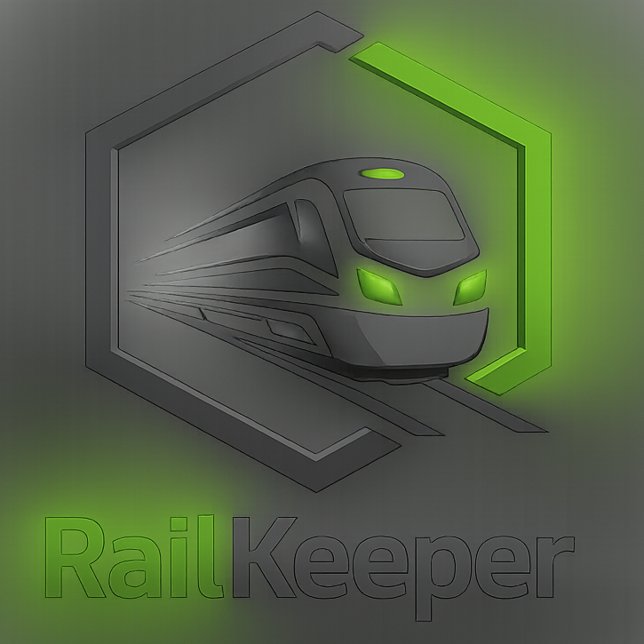
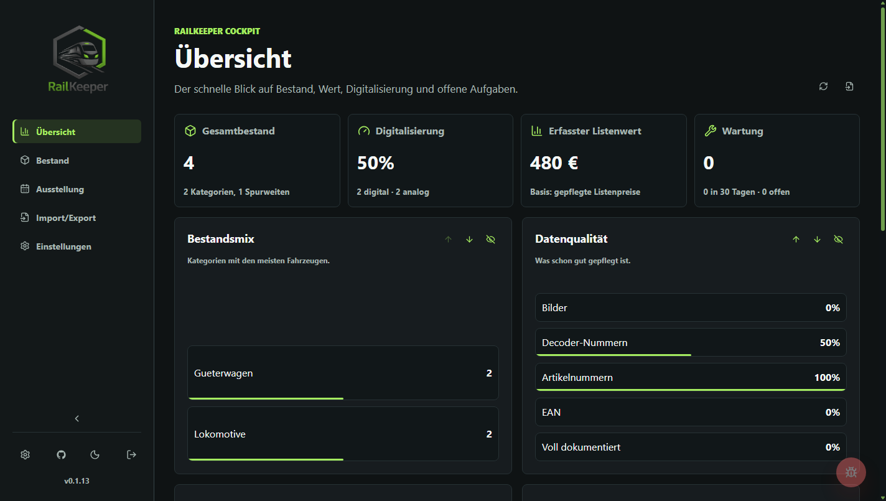
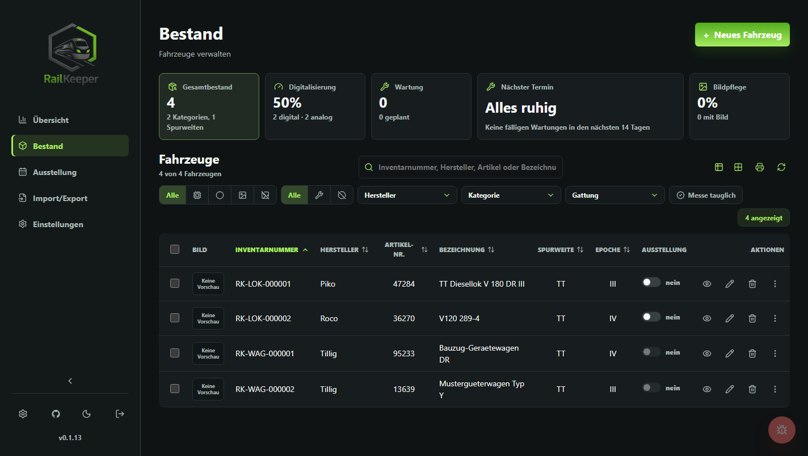
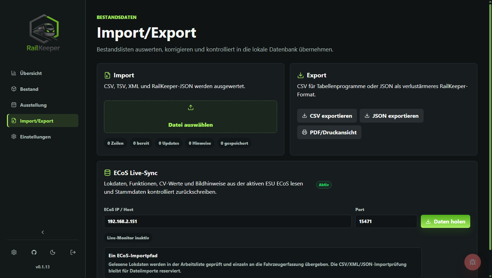
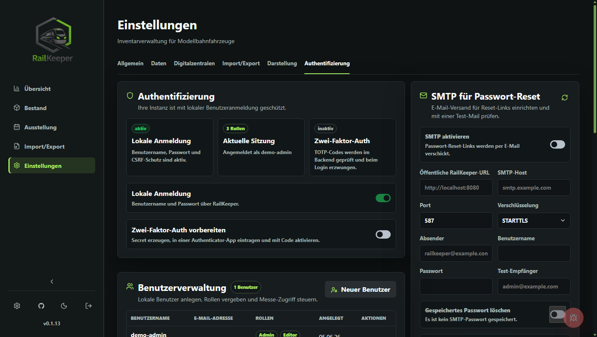
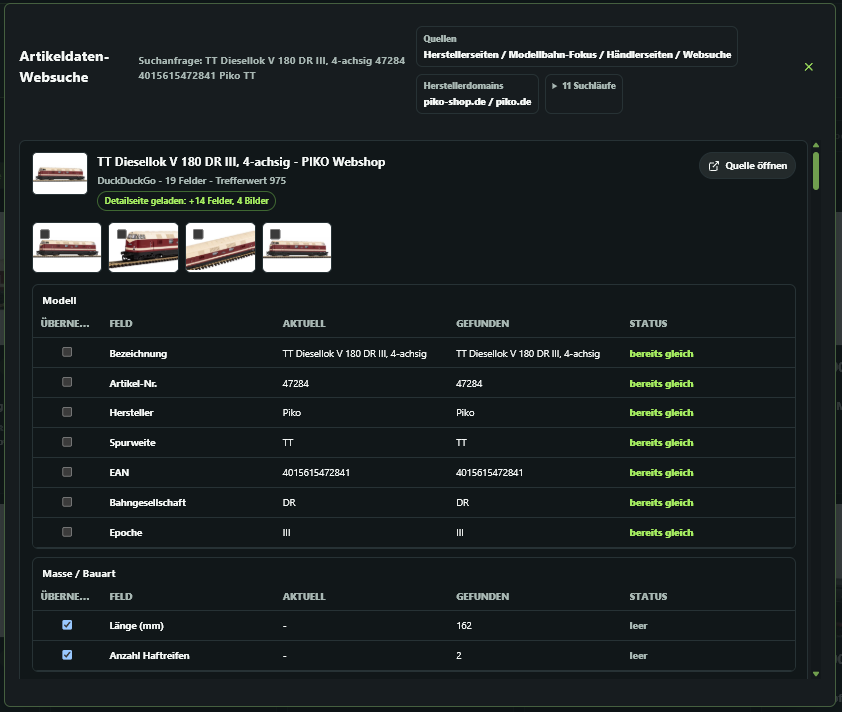
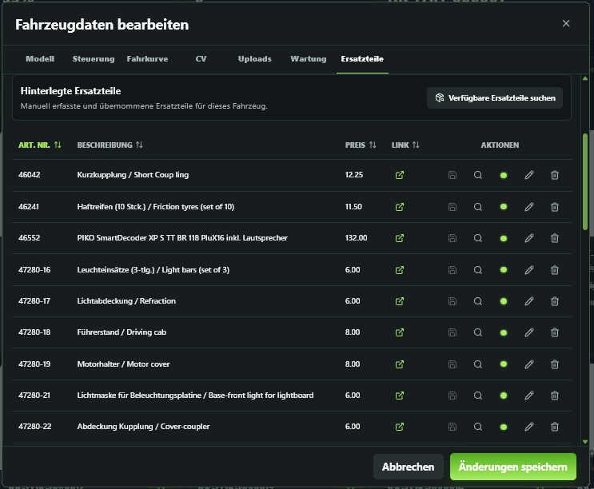
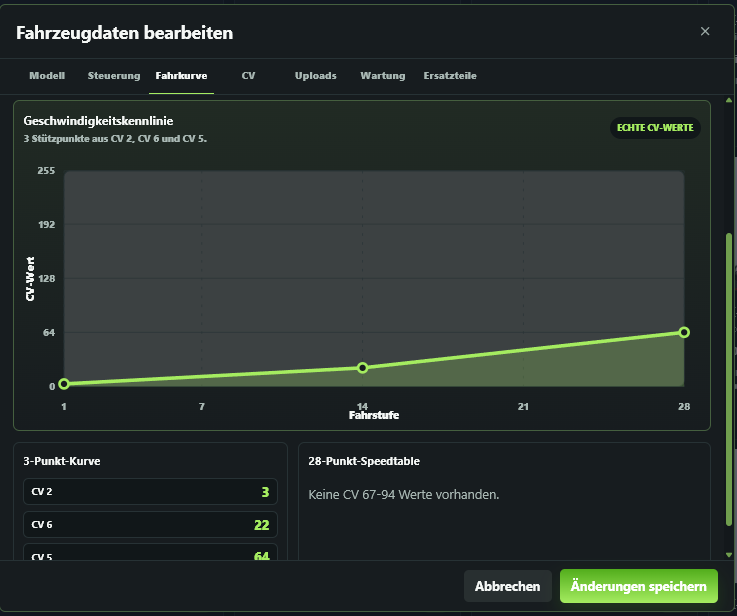

<p align="center">
  
</p>

<h1 align="center">RailKeeper</h1>

<p align="center">
  Selbst gehostetes Bestands-, Dokumentations- und Betriebswerkzeug für Modelleisenbahnsammlungen.
</p>

<p align="center">
  <a href="https://github.com/ichwars/RailKeeper/releases/latest"></a>
  <a href="https://github.com/ichwars/RailKeeper/actions/workflows/ci.yml"></a>
  
  
  
  
  <a href="LICENSE.md"></a>
  <a href="https://github.com/ichwars/RailKeeper/releases"></a>
</p>

<p align="center">
  <a href="README.md">English</a> · <strong>Deutsch</strong>
</p>

## Überblick

RailKeeper ist eine vollständige, selbst gehostete Anwendung, die Modelleisenbahnfahrzeuge,
Decoderdaten, Bilder, Dokumente, Wartungen, Ausstellungslisten und Importe in einem lokalen
Arbeitsbereich verwaltet. Sie läuft als einzelner Go-Dienst mit integriertem React-Frontend und
speichert sämtliche Betriebsdaten in SQLite.

Das Projekt richtet sich an private Sammlungen, Vereine und kleine Werkstätten, die ein ernsthaftes
Bestandssystem ohne Cloud-Abhängigkeit benötigen. RailKeeper hält Daten, Uploads und Backups unter
deiner Kontrolle und bietet gleichzeitig moderne Abläufe wie Artikelsuche im Web, strukturierte
Importprüfung, ECoS-Auslesung und die Suche nach neuen Releases.

## Funktionsumfang

- Lokaler Bestand mit SQLite, Uploads und JSON-Backups
- Fahrzeugdatensätze mit Modelldaten, technischen Feldern, Eigentumsangaben, Bildern, Anhängen, QR-Codes und übersichtlichen Leseansichten
- Artikelbestand mit generierten Inventarnummern, sortierbarer Auswahlspalte, Mengen- oder Einzelverfolgung, Lagerortbeständen, Reservierungen, Einbauten, Dokumenten und Nutzungshistorie
- Fundament für Anlagen, Module, Aufbauten und Planrevisionen mit Versionskonfliktschutz; der
  Arbeitsbereich bleibt vorübergehend aus der Hauptnavigation ausgeblendet, solange er weiter
  verfeinert wird
- Websuche nach Artikeldaten mit konfigurierbaren Quellen, Barcode-/EAN-Eingabe,
  ZXing-Kamerascanner, typisierten Gleis-Fachangaben und ausdrücklicher feldweiser Prüfung
- PDF-Berichtsdialog für Bestandsübersicht und Detaillisten mit auswählbaren Fahrzeugen, QR-Codes und Bildern
- Responsiver Bestandsablauf mit mobil optimierten Dialogen, Filtern und Kameraersatz für die Barcode-Eingabe
- Der kontrollierte ECoS-Lokabgleich liest Stammdaten, CV-Werte und statische Funktionstasten und
  schreibt Name, Adresse und Protokoll erst nach Vorschau und Bestätigung. Geschwindigkeit,
  Richtung, aktive Funktionszustände und ECoS-Anlagenobjektmanager werden nicht überwacht. Z21 per
  UDP und CS3 per HTTP bleiben reine Verbindungsadapter.
- Decoder-Funktionszuordnung von F0 bis F31 mit Symbolbibliothek und gespeicherten SVG-/PNG-Grafiken
- Strukturierte CV-Werte, CV-Import und -Export, Decoderprofile, NMRA-CV8-Herstellerstammdaten und ESU-/LokProgrammer-Dateimetadaten
- Wartungen, Zustandshistorie und durchsuchbare Dokumentation je Fahrzeug
- Ausstellungslisten mit Sperrstatus, eigener Messe-Rolle und druckfertigen Listenansichten
- Lokale Authentifizierung mit Ersteinrichtung, E-Mail-Adresse, Rollen, Sitzungen, Passwortänderung, tokenbasiertem Passwort-Reset und Audit-Log
- Benutzerspezifische Reihenfolge und Sichtbarkeit der Sidebar-Einträge
- Stammdatenverwaltung für Hersteller, Spurweiten, Epochen, Kategorien, Unterarten, Bahngesellschaften und Symbole
- Docker-Compose-Bereitstellung mit gehärtetem Laufzeitcontainer und persistentem `/data`-Volume
- Integrierte GitHub-Release-Prüfung mit Release-Notizen und benutzergesteuerter Aktualisierung

## Ansichten

RailKeeper ist um Arbeitsansichten statt Marketingseiten aufgebaut:

| Übersicht | Fahrzeugbestand |
| --- | --- |
|  |  |
| Import/Export | Authentifizierungseinstellungen |
|  |  |

| Artikel-Websuche | Ersatzteilsuche | Decoder-Geschwindigkeitskurve |
| --- | --- | --- |
|  |  |  |

- **Übersicht** für Bestand, Wert, Wartung und Datenqualität
- **Fahrzeugbestand** für Fahrzeugsuche, Filter, Leseansichten, Berichte, Bearbeitung, Uploads, CVs und Funktionstasten
- **Zubehör** für Artikeldaten- und Barcodesuche, sortierbare Bestandsdaten, Lagerbestände,
  Reservierungen, Einbauten, Dokumente und Historie
- **Ausstellung** für Messe- und Ausstellungsbetrieb
- **Import/Export** für CSV-, TSV-, XML- und JSON-Importe, kontrollierte Aktualisierungen und ECoS-Auslesung
- **Einstellungen** für Stammdaten, Darstellung, Backups, Aktualisierungen und Authentifizierung

## Schnellstart

### Windows Portable

Lade das Windows-Portable-ZIP aus einem Release herunter, entpacke es vollständig und starte:

```text
start-railkeeper.bat
```

RailKeeper läuft lokal ohne Installation oder zusätzliche Software und speichert Datenbank, Uploads
und Backups im Ordner `data` neben `RailKeeper.exe`. Der Betrieb von einem USB-Stick ist möglich.
Für den täglichen Einsatz sollte der entpackte Ordner auf einem lokalen Laufwerk liegen, weil dies
für die SQLite-Datenbank schneller und sicherer ist.

### Docker Compose

```bash
git clone https://github.com/ichwars/RailKeeper.git
cd RailKeeper
docker compose pull
docker compose up -d
```

Öffne:

```text
http://localhost:8080
```

Beim ersten Start öffnet RailKeeper die Einrichtung. Lege dort das erste Administratorkonto an.
RailKeeper enthält keine Standardzugangsdaten.

### Bestehende Docker-Installation aktualisieren

```bash
git pull
docker compose pull
docker compose up -d
```

SQLite-Datenbank, Uploads und lokale Dateien bleiben im Docker-Volume `railkeeper_data` erhalten.

Um statt `latest` ein bestimmtes Release festzulegen, trage Folgendes in `.env` ein:

```env
RAILKEEPER_IMAGE=ghcr.io/ichwars/railkeeper:v0.1.17.5
```

Wenn du bewusst den ausgecheckten Quellstand bauen möchtest, verwende:

```bash
docker compose up -d --build
```

### Optionale Umgebungsdatei

Kopiere `.env.example` nur dann nach `.env`, wenn du Betriebseinstellungen wie sichere Cookies,
Upload-Limits, Druckerkonfiguration oder den GitHub-Release-Endpunkt überschreiben möchtest.

Diese Containerpfade dürfen in Docker Compose nicht überschrieben werden:

```env
RAILKEEPER_DATA_DIR=/data
RAILKEEPER_MIGRATIONS_DIR=/app/migrations
RAILKEEPER_SEEDS_DIR=/app/seeds
RAILKEEPER_STATIC_DIR=/app/web
```

## Lokale Entwicklung

Backend:

```bash
cd backend
go test ./...
go run ./cmd/railkeeper
```

Frontend:

```bash
cd frontend
npm ci
npm run build
```

Die Produktionslaufzeit stellt das gebaute Frontend aus `frontend/dist` bereit.

Erstelle ein Windows-Portable-Paket:

```powershell
.\tools\build_windows_portable.ps1
```

Das Skript baut das Frontend, kompiliert `RailKeeper.exe` für Windows x64 und erstellt
`dist\windows-portable\RailKeeper-windows-x64-v<version>.zip`.

Nützliche lokale Standardwerte:

```env
RAILKEEPER_ADDR=:8080
RAILKEEPER_DATA_DIR=./data
RAILKEEPER_MIGRATIONS_DIR=./backend/migrations
RAILKEEPER_SEEDS_DIR=./backend/seeds
RAILKEEPER_STATIC_DIR=./frontend/dist
RAILKEEPER_COOKIE_SECURE=false
RAILKEEPER_UPDATE_CHECK_URL=https://api.github.com/repos/ichwars/RailKeeper/releases/latest
```

Optionale SMTP-Einstellungen für Passwort-Reset-E-Mails lassen sich in der Admin-Oberfläche unter
`Einstellungen > Authentifizierung > SMTP für Passwort-Reset` konfigurieren. Die folgenden
Umgebungsvariablen bleiben als Vorgaben für die Bereitstellung verfügbar:

```env
RAILKEEPER_PUBLIC_URL=https://railkeeper.example.test
RAILKEEPER_SMTP_HOST=smtp.example.test
RAILKEEPER_SMTP_PORT=587
RAILKEEPER_SMTP_USER=railkeeper@example.test
RAILKEEPER_SMTP_PASSWORD=change-me
RAILKEEPER_SMTP_FROM=railkeeper@example.test
RAILKEEPER_SMTP_TLS=starttls
```

Passwort-Reset-E-Mails werden nur versendet, wenn `RAILKEEPER_PUBLIC_URL` oder die in der
Admin-Oberfläche gespeicherte öffentliche URL eine gültige HTTP(S)-Origin ist. RailKeeper leitet
versendete Reset-Links niemals aus dem `Host`-Header der Anfrage ab.

Ist SMTP nicht konfiguriert, gibt der Browser keine Passwort-Reset-Links zurück. Nur für die lokale
Wiederherstellung schreibt das Backend den Link in das Serverprotokoll.

### Optionale OCR-Erkennung für gescannte Ersatzteil-PDFs

RailKeeper liest textbasierte PDF-Ersatzteillisten direkt. Installiere für gescannte PDFs ohne
Textebene entweder `ocrmypdf` oder sowohl `pdftoppm` als auch `tesseract` auf dem Host und halte die
Werkzeuge in `PATH` verfügbar. Der OCR-Ersatz wird nur verwendet, wenn die integrierte
PDF-Texterkennung keinen verwertbaren Ersatzteiltext findet.

```env
RAILKEEPER_PDF_OCR=on
RAILKEEPER_PDF_OCR_MAX_PAGES=4
```

Setze `RAILKEEPER_PDF_OCR=off`, um den Ersatz ausdrücklich zu deaktivieren.

## Architektur

```text
backend/
  cmd/railkeeper/          Go-Einstiegspunkt
  internal/api/            HTTP-Routen, Middleware und Antwortabbildung
  internal/application/    Anwendungsfälle, Validierung, Backup und Transaktionen
  internal/infrastructure/ SQLite, Migrationen und Seed-Laden
  migrations/              SQLite-Schemamigrationen
  seeds/                   Stammdaten-Seed als JSON
frontend/
  src/app/                 Shell, Routing und globale Stile
  src/features/            Einrichtung, Auth, Fahrzeuge, Ausstellung, Import/Export, Einstellungen
  src/shared/              API-Adapter, i18n und gemeinsame Frontend-Typen
openapi/
  railkeeper.yaml          API-Vertrag
deploy/
  README.md                Hinweise zur Bereitstellung
docs/
  architecture.md
  production-runbook.md
  roadmap.md
  security.md
```

## Sicherheit

RailKeeper ist für vertrauenswürdige, selbst gehostete Umgebungen vorgesehen. Die
Standardinstallation vermeidet dennoch die üblichen Fehler:

- kein Standard-Administratorkonto
- Argon2id-Passworthashing
- HTTP-only-Sitzungscookies
- SameSite-Cookies und CSRF-Schutz
- Rollenprüfungen für Viewer-, Editor-, Admin- und Messe-Abläufe
- Ratenbegrenzung für Einrichtung, Anmeldung und Sitzungen
- Passwort-Reset-Links per E-Mail, wenn SMTP konfiguriert ist
- Audit-Log für relevante Sicherheits- und Datenaktionen
- Upload-Größenbegrenzung und Sperre ausführbarer Anhänge
- Laufzeitdaten werden von Git ignoriert

Setze für HTTPS-Bereitstellungen:

```env
RAILKEEPER_COOKIE_SECURE=true
```

## Zähler und Badges

Die README enthält einen GitHub-Zähler für Release-Downloads. GitHub stellt weder einen
zuverlässigen öffentlichen README-Aufrufzähler noch einen allgemeinen Installationszähler für
selbst gehostete Docker-Bereitstellungen bereit. Dafür wären Drittanbietertracking,
Paketregistermetriken oder ausdrücklich aktivierte Telemetrie erforderlich. RailKeeper aktiviert
nichts davon.

## Lizenz

RailKeeper wird unter `AGPL-3.0-only` veröffentlicht. Siehe [LICENSE.md](LICENSE.md).

RailKeeper ist eine lokale, selbst gehostete Anwendung. Die AGPL-3.0 hält Weiterentwicklungen offen
und verpflichtet Betreiber einer über ein Netzwerk bereitgestellten, veränderten Fassung, ihren
Nutzern den korrespondierenden Quellcode zugänglich zu machen. Damit schützt sie die dauerhafte
Offenheit des Projekts besser als die bisherige freizügige Lizenz. Die AGPL erlaubt kommerzielle
Nutzung. Bereits veröffentlichte Fassungen behalten die Lizenzbedingungen, unter denen sie
veröffentlicht wurden.

Die Softwarelizenz überträgt keine Rechte an Projektkennzeichen oder fremden Marken, Grafiken,
Dokumentationen oder Protokollrechten. Siehe [TRADEMARKS.md](TRADEMARKS.md) und
[THIRD_PARTY_NOTICES.md](THIRD_PARTY_NOTICES.md).

## Unterstützung

Freiwillige Zuwendungen helfen bei Entwicklungs- und Projektkosten. Sie begründen keinen Anspruch
auf kostenpflichtige Funktionen, Support, Reaktionszeiten oder besonderen Zugang.

- [GitHub Sponsors](https://github.com/sponsors/ichwars)
- [Ko-fi](https://ko-fi.com/ichwars)

Supportwege und Abgrenzungen stehen in [SUPPORT.md](SUPPORT.md).
