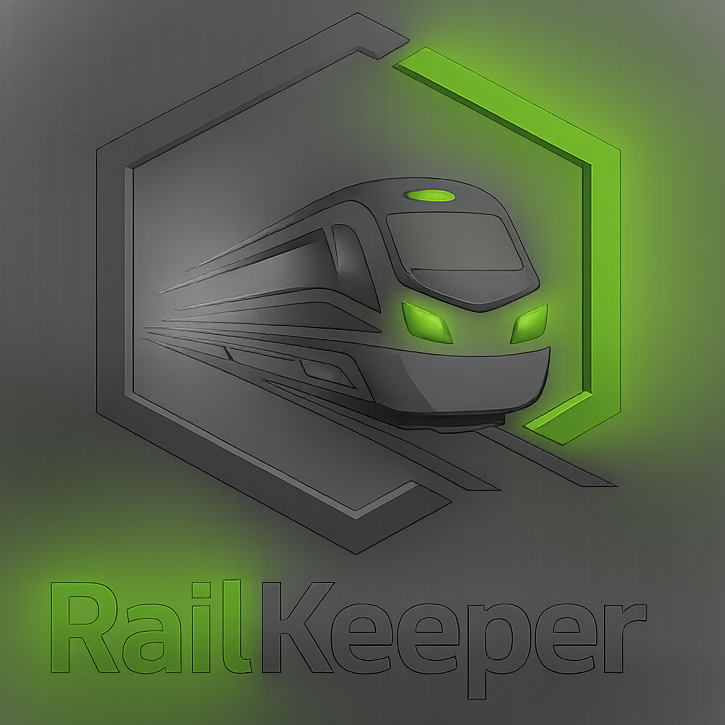
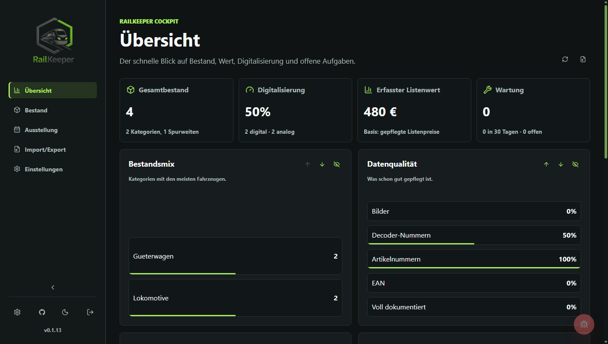
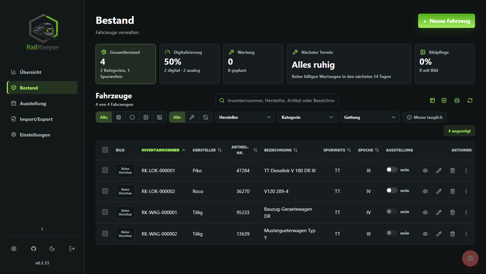
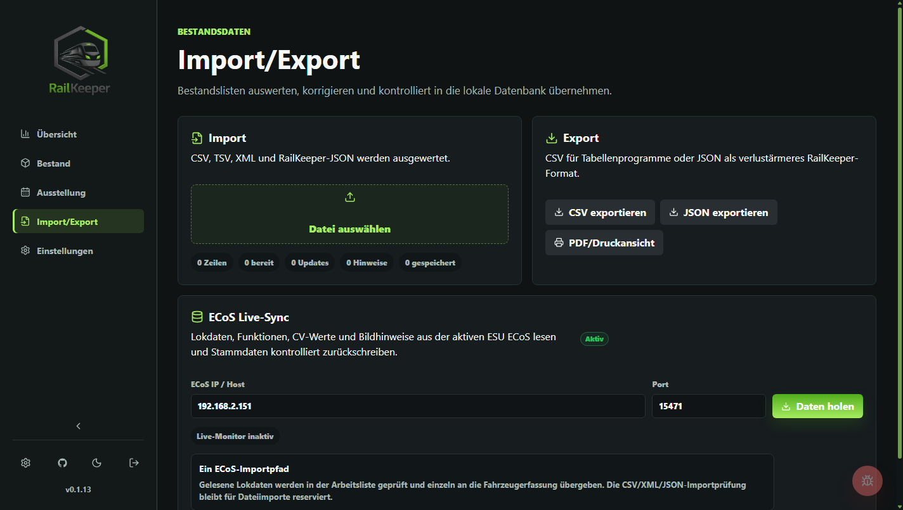
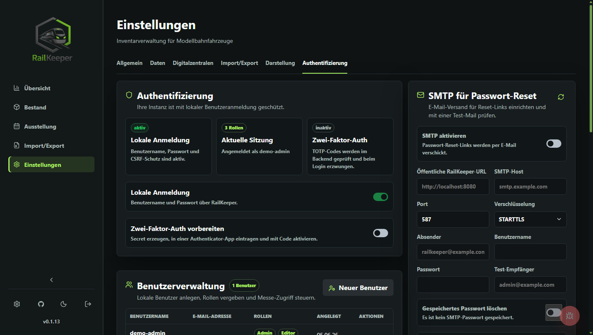
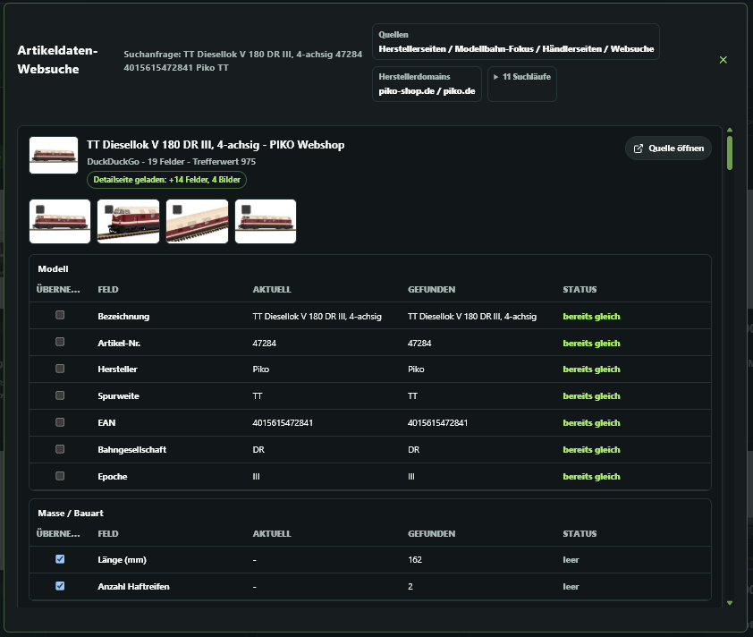
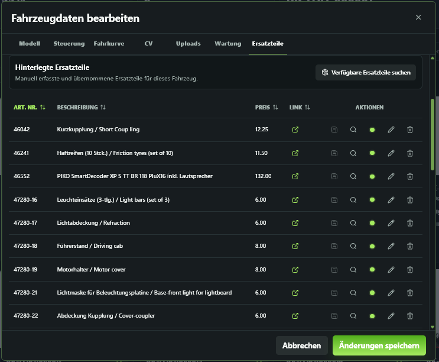
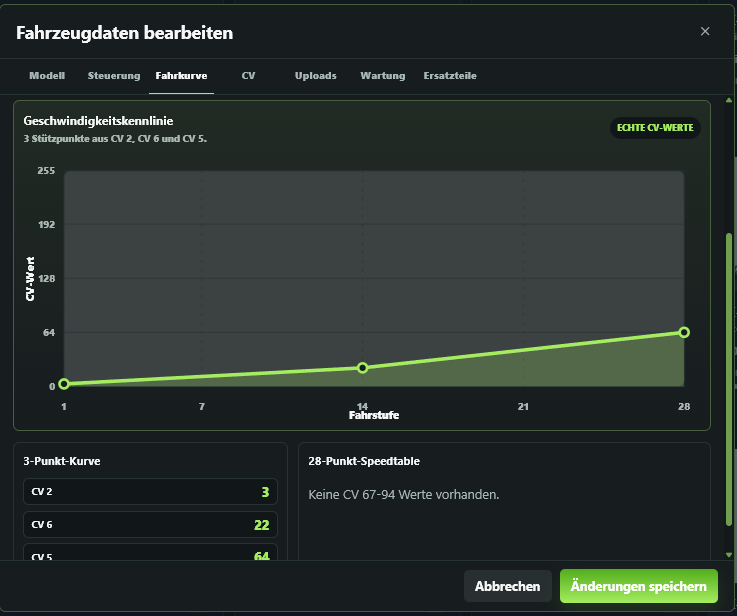

<p align="center">
  
</p>

<h1 align="center">RailKeeper</h1>

<p align="center">
  Self-hosted inventory, documentation and operations cockpit for model railway collections.
</p>

<p align="center">
  <a href="https://github.com/ichwars/RailKeeper/releases/latest"></a>
  <a href="https://github.com/ichwars/RailKeeper/actions/workflows/ci.yml"></a>
  
  
  
  
  <a href="LICENSE.md"></a>
  <a href="https://github.com/ichwars/RailKeeper/releases"></a>
</p>

## Overview

RailKeeper is a complete self-hosted application for managing model railway vehicles, decoder data, images, documents, maintenance, exhibition lists and imports in one local-first workspace. It runs as a single Go service with an integrated React frontend and stores all operational data in SQLite.

The project is designed for private collections, clubs and small workshops that want a serious inventory system without a cloud dependency. RailKeeper keeps data, uploads and backups under your control while still offering modern workflows such as article web search, structured import review, ECoS readout and release update checks.

## Highlights

- Local-first inventory with SQLite, uploads and JSON backups
- Vehicle records with model data, technical fields, ownership details, images, attachments, QR codes and clean read-only detail views
- Article data web search with configurable sources, barcode/EAN entry, ZXing-based camera scanning and explicit field-by-field review
- PDF report dialog for inventory overview and detail lists with selectable vehicles, QR codes and images
- Responsive inventory workflow with mobile-optimized dialogs, filter controls and camera fallback for barcode entry
- Digital command-station adapters: ECoS live read/write sync plus Z21 UDP and CS3 HTTP connection tests
- Decoder function mapping from F0 to F31 with symbol library and stored SVG/PNG graphics
- Structured CV values, CV import/export, decoder profiles, NMRA CV8 manufacturer master data and ESU/LokProgrammer file metadata
- Maintenance, condition history and searchable documentation per vehicle
- Exhibition lists with lock state, dedicated Messe role and print-ready list views
- Local authentication with first-run setup including email, roles, sessions, password change, token-based password reset and audit log
- User-specific sidebar order and visibility for tailoring the main navigation per login
- Master data management for manufacturers, gauges, epochs, categories, subtypes, railway companies and symbols
- Docker Compose deployment with hardened runtime container and persistent `/data` volume
- Built-in GitHub release update check with release notes and user-controlled installation flow

## Screens

RailKeeper is built around operational views instead of marketing pages:

| Overview | Inventory |
| --- | --- |
|  |  |
| Import/Export | Authentication Settings |
|  |  |

| Article Web Search | Spare Parts Search | Decoder Speed Curve |
| --- | --- | --- |
|  |  |  |

- **Overview** for inventory, value, maintenance and data quality
- **Inventory** for vehicle search, filtering, read views, reports, editing, uploads, CVs and function keys
- **Exhibition List** for fair/show operations
- **Import/Export** for CSV, TSV, XML and JSON imports, controlled updates and ECoS readout
- **Settings** for master data, appearance, backups, updates and authentication

## Quick Start

### Windows Portable

Download the Windows portable ZIP from a release, extract it completely and start:

```text
start-railkeeper.bat
```

RailKeeper runs locally without installation or additional software and stores its database, uploads and backups in the `data` folder next to `RailKeeper.exe`. It can also be started from a USB stick, but for daily use the extracted folder should live on the local computer because this is faster and safer for the SQLite database.

### Docker Compose

```bash
git clone https://github.com/ichwars/RailKeeper.git
cd RailKeeper
docker compose pull
docker compose up -d
```

Open:

```text
http://localhost:8080
```

On first start RailKeeper opens the setup screen. Create the first admin account there. No default credentials are shipped.

### Update an existing Docker installation

```bash
git pull
docker compose pull
docker compose up -d
```

The SQLite database, uploads and local files stay in the `railkeeper_data` Docker volume.

To pin a specific release instead of `latest`, set this in `.env`:

```env
RAILKEEPER_IMAGE=ghcr.io/ichwars/railkeeper:v0.1.13
```

If you intentionally want to build the checked-out source tree, use:

```bash
docker compose up -d --build
```

### Optional environment file

Copy `.env.example` to `.env` only when you want to override operational settings such as secure cookies, upload limits, printer configuration or the GitHub release endpoint.

Do not override these container paths in Docker Compose:

```env
RAILKEEPER_DATA_DIR=/data
RAILKEEPER_MIGRATIONS_DIR=/app/migrations
RAILKEEPER_SEEDS_DIR=/app/seeds
RAILKEEPER_STATIC_DIR=/app/web
```

## Local Development

Backend:

```bash
cd backend
go test ./...
go run ./cmd/railkeeper
```

Frontend:

```bash
cd frontend
npm ci
npm run build
```

The production runtime serves the built frontend from `frontend/dist`.

Create a Windows portable package:

```powershell
.\tools\build_windows_portable.ps1
```

The script builds the frontend, cross-compiles `RailKeeper.exe` for Windows x64 and creates `dist\windows-portable\RailKeeper-windows-x64-v<version>.zip`.

Useful local defaults:

```env
RAILKEEPER_ADDR=:8080
RAILKEEPER_DATA_DIR=./data
RAILKEEPER_MIGRATIONS_DIR=./backend/migrations
RAILKEEPER_SEEDS_DIR=./backend/seeds
RAILKEEPER_STATIC_DIR=./frontend/dist
RAILKEEPER_COOKIE_SECURE=false
RAILKEEPER_UPDATE_CHECK_URL=https://api.github.com/repos/ichwars/RailKeeper/releases/latest
```

Optional SMTP settings for password reset emails can be configured in the Admin UI under
`Einstellungen > Authentifizierung > SMTP für Passwort-Reset`. The environment variables
below remain useful as deployment defaults:

```env
RAILKEEPER_PUBLIC_URL=https://railkeeper.example.test
RAILKEEPER_SMTP_HOST=smtp.example.test
RAILKEEPER_SMTP_PORT=587
RAILKEEPER_SMTP_USER=railkeeper@example.test
RAILKEEPER_SMTP_PASSWORD=change-me
RAILKEEPER_SMTP_FROM=railkeeper@example.test
RAILKEEPER_SMTP_TLS=starttls
```

If SMTP is not configured, password reset links are not returned to the browser. For local recovery only, the backend writes the link to the server log.

### Optional OCR for scanned spare-parts PDFs

RailKeeper reads text-based PDF spare-parts lists directly. For scanned PDFs without a text layer,
install either `ocrmypdf` or both `pdftoppm` and `tesseract` on the host and keep the tools available
in `PATH`. The OCR fallback is used only when the built-in PDF text extraction does not find usable
spare-parts text.

```env
RAILKEEPER_PDF_OCR=on
RAILKEEPER_PDF_OCR_MAX_PAGES=4
```

Set `RAILKEEPER_PDF_OCR=off` to disable the fallback explicitly.

## Architecture

```text
backend/
  cmd/railkeeper/          Go entrypoint
  internal/api/            HTTP routes, middleware and response mapping
  internal/application/    use cases, validation, backup and transactions
  internal/infrastructure/ SQLite, migrations and seed loading
  migrations/              SQLite schema migrations
  seeds/                   master data seed JSON
frontend/
  src/app/                 shell, routing and global styles
  src/features/            setup, auth, vehicles, exhibition, import/export, settings
  src/shared/              API adapter, i18n and shared frontend types
openapi/
  railkeeper.yaml          API contract
deploy/
  README.md                deployment notes
docs/
  architecture.md
  production-runbook.md
  roadmap.md
  security.md
```

## Security

RailKeeper is intended for trusted self-hosted environments, but the default installation avoids the common mistakes:

- no default admin account
- Argon2id password hashing
- HTTP-only session cookies
- SameSite cookies and CSRF protection
- role checks for viewer, editor, admin and Messe workflows
- setup, login and session rate limiting
- password reset links are sent by email when SMTP is configured
- audit log for relevant security and data actions
- upload size limits and executable attachment blocking
- runtime data ignored by Git

For HTTPS deployments set:

```env
RAILKEEPER_COOKIE_SECURE=true
```

## Counters And Badges

The README includes a GitHub release download badge. GitHub does not provide a reliable public README view counter or generic install counter for self-hosted Docker deployments. Those would require third-party tracking, package registry metrics or explicit opt-in telemetry, none of which is enabled by RailKeeper.

## License

RailKeeper is released under the MIT Self-Hosting License. See [LICENSE.md](LICENSE.md).

## Support

If RailKeeper saves you time, coffee is a perfectly acceptable bug fuel:

<a href="https://www.buymeacoffee.com/drothe20128" target="_blank"></a>
